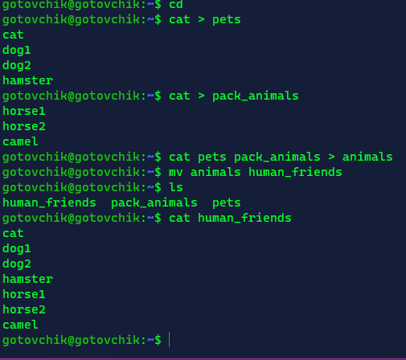
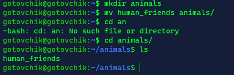
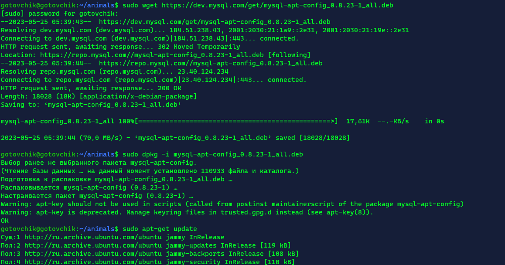
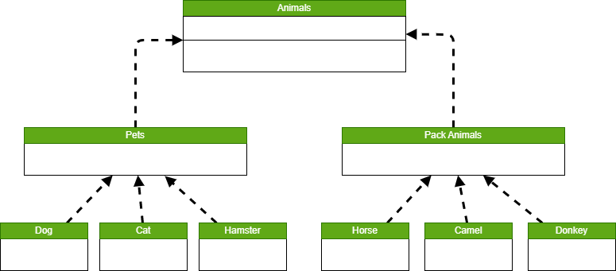

# Итоговая контрольная работа

## Информация о проекте

Необходимо организовать систему учета для питомника, в котором живут домашние и вьючные животные.

## Как сдавать проект

Для сдачи проекта необходимо создать отдельный общедоступный
репозиторий(Github).  
Разработку вести в этом репозитории, использовать пул реквесты на изменения.  
Программа должна запускаться и работать, ошибок при выполнении программы быть не должно.  

## Задания и ход выполнения работы.
Создал репозиторий на github. Далее создал рабочую директорию и клонировал репозиторий.

```shell
mkdir final-attestation
cd .\final-attestation\
git clone https://github.com/gotovchik/final-attestation.git
```

1. Используя команду cat в терминале операционной системы Linux, создать
два файла Домашние животные (заполнив файл собаками, кошками,
хомяками) и Вьючные животными заполнив файл Лошадьми, верблюдами и
ослы), а затем объединить их. Просмотреть содержимое созданного файла.
Переименовать файл, дав ему новое имя (Друзья человека).

2. Создать директорию, переместить файл туда.

3. Подключить дополнительный репозиторий MySQL. Установить любой пакет
из этого репозитория.
4. Установить и удалить deb-пакет с помощью dpkg.
5. Выложить историю команд в терминале ubuntu

6. Нарисовать диаграмму, в которой есть класс родительский класс, домашние
животные и вьючные животные, в составы которых в случае домашних
животных войдут классы: собаки, кошки, хомяки, а в класс вьючные животные
войдут: Лошади, верблюды и ослы.

7. В подключенном MySQL репозитории создать базу данных “Друзья
человека”

```sql
CREATE DATABASE "HumanFriends"
```

8. Создать таблицы с иерархией из диаграммы в БД
<details>
<summary>SQL-запросы</summary>

```sql
--DROP TABLE IF EXISTS animals_groups

CREATE TABLE IF NOT EXISTS animal_groups
(
 group_id serial PRIMARY KEY,
 group_name VARCHAR(20) NOT NULL
);

INSERT INTO animal_groups (group_name)
VALUES
('вьючные'),
('домашние');

--DROP TABLE IF EXISTS pack_animals

CREATE TABLE IF NOT EXISTS pack_animals
(
 animal_id serial PRIMARY KEY,
 animal_name VARCHAR(20) NOT NULL,
 group_id int NOT NULL,
 FOREIGN KEY (group_id) REFERENCES animals_groups (group_id) 
);

INSERT INTO pack_animals (animal_name, group_id)
VALUES
('Лошади', 1),
('Ослы', 1),
('Верблюды', 1);

--DROP TABLE IF EXISTS pets

CREATE TABLE IF NOT EXISTS pets
(
 pet_id serial PRIMARY KEY,
 pet_name VARCHAR(20) NOT NULL,
 group_id int NOT NULL,
 FOREIGN KEY (group_id) REFERENCES animals_groups (group_id) 
);

INSERT INTO pets (pet_name, group_id)
VALUES
('Кошки', 2),
('Собаки', 2),
('Хомяки', 2);

--DROP TABLE IF EXISTS donkeys

CREATE TABLE IF NOT EXISTS donkeys
(
 donkey_id serial PRIMARY KEY,
 donkey_name VARCHAR(20)  NOT NULL,
 command VARCHAR(20),
 animal_id int NOT NULL,
 FOREIGN KEY (animal_id) REFERENCES pack_animals (animal_id) 
);

INSERT INTO donkeys (donkey_name, command, animal_id)
VALUES
('Иа', 'Везти!', 2),
('Сет', 'Пить!', 2),
('Ниниб', 'Стимул!', 2);

--DROP TABLE IF EXISTS horses

CREATE TABLE IF NOT EXISTS horses
(
 horse_id serial PRIMARY KEY,
 horse_name VARCHAR(20)  NOT NULL,
 command VARCHAR(20),
 animal_id int NOT NULL,
 FOREIGN KEY (animal_id) REFERENCES pack_animals (animal_id) 
);

INSERT INTO horses (horse_name, command, animal_id)
VALUES
('Буцефал', 'Захватить!', 1),
('Лошарик', 'Жонглировать!', 1),
('Педальный', 'Но, пошла!', 1);

--DROP TABLE IF EXISTS camels

CREATE TABLE IF NOT EXISTS camels
(
 camel_id serial PRIMARY KEY,
 camel_name VARCHAR(20)  NOT NULL,
 command VARCHAR(20),
 animal_id int NOT NULL,
 FOREIGN KEY (animal_id) REFERENCES pack_animals (animal_id) 
);

INSERT INTO camels (camel_name, command, animal_id)
VALUES
('Вася', 'Право!', 3),
('Вильма', 'Лево!', 3),
('Тоффи', 'Стой!', 3);

--DROP TABLE IF EXISTS cats

CREATE TABLE IF NOT EXISTS cats
(
 cat_id serial PRIMARY KEY,
 cat_name VARCHAR(20)  NOT NULL,
 command VARCHAR(20),
 pet_id int NOT NULL,
 FOREIGN KEY (pet_id) REFERENCES pets (pet_id) 
);

INSERT INTO cats (cat_name, command, pet_id)
VALUES
('Рыжик', 'Есть!', 1),
('Барсик', 'Спать!', 1),

--DROP TABLE IF EXISTS в dogs

CREATE TABLE IF NOT EXISTS dogs
(
 dog_id serial PRIMARY KEY,
 dog_name VARCHAR(20)  NOT NULL,
 command VARCHAR(20),
 pet_id int NOT NULL,
 FOREIGN KEY (pet_id) REFERENCES pets (pet_id) 
);

INSERT INTO dogs (dog_name, command, pet_id)
VALUES
('Барбос', 'Сидеть!', 2),
('Рекс', 'В погоню!', 2),

--DROP TABLE IF EXISTS в hamsters

CREATE TABLE IF NOT EXISTS hamsters
(
 hamster_id serial PRIMARY KEY,
 hamster_name VARCHAR(20)  NOT NULL,
 command VARCHAR(20),
 pet_id int NOT NULL,
 FOREIGN KEY (pet_id) REFERENCES pets (pet_id) 
);

INSERT INTO hamsters (hamster_name, command, pet_id)
VALUES
('Хомка', 'Смирно!', 3),
('Пушок', 'Сальто!', 3),

```

</details>

13. Создать класс с Инкапсуляцией методов и наследованием по диаграмме.
14. Написать программу, имитирующую работу реестра домашних животных.
В программе должен быть реализован следующий функционал:  
14.1 Завести новое животное  
14.2 определять животное в правильный класс  
14.3 увидеть список команд, которое выполняет животное  
14.4 обучить животное новым командам  
14.5 Реализовать навигацию по меню  
15. Создайте класс Счетчик, у которого есть метод add(), увеличивающий̆
значение внутренней̆int переменной̆на 1 при нажатие “Завести новое
животное” Сделайте так, чтобы с объектом такого типа можно было работать в
блоке try-with-resources. Нужно бросить исключение, если работа с объектом
типа счетчик была не в ресурсном try и/или ресурс остался открыт. Значение
считать в ресурсе try, если при заведения животного заполнены все поля.
